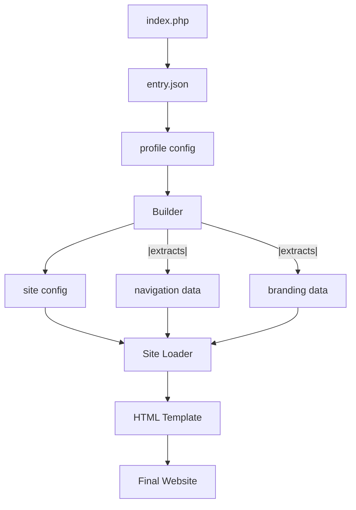

# Portfolio Website Scaffolding System - Architecture Documentation

## **Overview**

This is a **sophisticated, component-based portfolio website scaffolding system** designed to be data-driven, highly modular, and configuration-based. The system allows for creating multiple portfolio variations through simple JSON configuration changes while maintaining clean separation of concerns.

---

## **Design Philosophy**

### **Core Principles**

1. **Configuration Over Code**
   - Content and structure changes through JSON files
   - No need to modify code for different portfolio types
   - Easy content management and updates

2. **Component-Based Architecture**
   - Self-contained blocks with their own templates, styles, and behaviors
   - Reusable components across different profiles
   - Versioned components (using `_t1` suffix) for evolution

3. **Separation of Concerns**
   - **Data** (JSON) ↔ **Structure** (HTML) ↔ **Style** (CSS) ↔ **Behavior** (JS)
   - **Configuration** ↔ **Presentation** ↔ **Logic**
   - Clear boundaries between each layer

4. **Data-Driven Architecture**
   - Builder orchestrates data flow from JSON to HTML
   - Loaders receive specific data as parameters
   - No file reading within loaders - only data processing

---

## **System Architecture**

### **Directory Structure**
```
portfolio-website/
├── index.php                 # Main entry point
├── api.php                   # API entry point
├── README.md                 # Project overview
├── docs/                     # Documentation
│   └── system-architecture.md # This file
├── definitions/             # Configuration files
│   ├── entry.json          # Entry point configuration
│   ├── profiles/           # Profile configurations
│   ├── pages/             # Page definitions
│   └── sites/             # Site layout configurations
├── builders/               # Build system
├── blocks/                 # Component blocks
│   ├── components/         # UI components
│   ├── containers/         # Layout containers
│   └── sites/             # Site-level blocks
├── assets/                 # Static resources
│   ├── files/             # File assets
│   └── media/             # Media assets
└── endpoints/             # API endpoints
```

### **Block Structure Pattern**
Each block follows a consistent pattern:
```
blocks/[type]/[component]/type_1/
├── [component]_structure_t1.html      # HTML template
├── [component]_loader_t1.php          # Dynamic content loader
├── [component]_style_main_t1.css      # Main CSS file
├── [component]_behavior_main_t1.js    # Main JS file
├── styles/                            # CSS modules
└── behaviors/                         # JS modules
```

---

## **Data Flow Architecture**

### **Request Flow**
```
User Request → index.php → entry.json → builder selection → profile.json → site.json → builder → loader → HTML
```

### **Detailed Flow**
1. **`index.php`** reads `definitions/entry.json`
2. **Entry config** determines profile configuration and builder selection
3. **Builder parameters** extracted from profile configuration
4. **Specified builder** loaded with custom parameters
5. **Profile config** specifies site type and pages
6. **Builder** loads site configuration and extracts relevant data
7. **Builder parameters** passed to site loaders for customization
8. **Site loader** receives data and parameters, fills HTML template placeholders
9. **Final HTML** returned to browser with profile-specific optimizations

### **Component Interaction**


---

## **Configuration System**

### **Entry Configuration** (`definitions/entry.json`)
```json
{
    "default_profile": "ml_mlops",
    "default_builder": "builder_t1.php",
    "profiles": {
        "ml_mlops": {
            "profile": "ml_mlops_t1.json",
            "builder": "builder_t1.php",
            "parameters": {
                "theme": "professional",
                "optimization": "performance",
                "debug": false
            }
        },
        "frontend_dev": {
            "profile": "frontend_dev_t1.json",
            "builder": "builder_t1.php",
            "parameters": {
                "theme": "creative",
                "optimization": "development",
                "debug": true
            }
        }
    },
    "builders": {
        "builder_t1.php": {
            "description": "Standard portfolio builder with full feature set",
            "version": "1.0",
            "capabilities": ["components", "containers", "sites", "navigation", "themes"]
        }
    }
}
```
- **Enhanced Structure**: Object-based profile configuration with builder parameters
- **Builder Selection**: Each profile can specify its own builder file
- **Parameter System**: Custom parameters passed to builder for profile-specific behavior
- **Builder Registry**: Documentation of available builders and their capabilities
- **Backward Compatibility**: Supports both old string format and new object format
- **Debug Support**: Development profiles can enable debugging features

### **Profile Configuration** (`definitions/profiles/[profile].json`)
```json
{
    "site": "top_bar_site_t1.json",
    "pages": [
        "summary_page_t1.json",
        "education_page_t1.json",
        "experience_page_t1.json",
        "skills_page_t1.json",
        "projects_page_t1.json",
        "control_page_t1.json"
    ]
}
```
- Specifies site layout type
- Lists all pages for the profile
- Acts as the main configuration orchestrator

### **Site Configuration** (`definitions/sites/[site].json`)
```json
{
    "type": "top_bar",
    "navigation": {
        "tabs": [
            {
                "id": "summary",
                "label": "About",
                "page": "summary_page_t1.json",
                "active": true
            }
            // ... more tabs
        ]
    },
    "branding": {
        "title": "Portfolio"
    }
}
```
- Defines navigation structure
- Specifies branding elements
- Contains only data, no styling information

---

## **Multi-Profile URL Routing**

### **Universal Routing System**
The system supports **multiple portfolio profiles** accessible via different URLs, designed to work on **any server** without special configuration requirements.

### **Routing Methods**

#### **Method 1: Query Parameters (Universal)**
Works on **all servers** without any configuration:
```
https://yoursite.com/?profile=ml_mlops          # ML/MLOps Portfolio
https://yoursite.com/?profile=frontend_dev      # Frontend Developer Portfolio
https://yoursite.com/?profile=fullstack         # Full-Stack Portfolio
https://yoursite.com/?profile=data_scientist    # Data Scientist Portfolio
https://yoursite.com/                           # Default Profile
```

#### **Method 2: Clean URLs (Server-Dependent)**
Works when server supports URL rewriting:
```
https://yoursite.com/ml_mlops                    # ML/MLOps Portfolio
https://yoursite.com/frontend_dev                # Frontend Developer Portfolio
https://yoursite.com/fullstack                   # Full-Stack Portfolio
https://yoursite.com/data_scientist              # Data Scientist Portfolio
```

### **URL Processing Logic**

#### **Resolution Priority**
1. **Query Parameter Check**: `?profile=profile_key`
2. **URL Path Parsing**: `/profile_key`
3. **Default Fallback**: Uses `default_profile`

#### **Processing Flow**
```php
// 1. Check query parameter (works everywhere)
if (isset($_GET['profile'])) {
    $profile = $_GET['profile'];
}

// 2. Parse URL path (works with rewriting)
else {
    $path = parse_url($_SERVER['REQUEST_URI'], PHP_URL_PATH);
    $profile = extract_profile_from_path($path);
}

// 3. Fallback to default
if (!valid_profile($profile)) {
    $profile = $entryConfig['default_profile'];
}
```

### **Server Compatibility**

#### **✅ Universal Support (No Configuration)**
- **Apache** (any version, no .htaccess needed)
- **Nginx** (any configuration)
- **IIS** (Windows servers)
- **Shared Hosting** (most providers)
- **Cloud Platforms** (Heroku, AWS, Google Cloud, etc.)
- **Local Development** (XAMPP, WAMP, MAMP, PHP dev server)

#### **🎯 Deployment Benefits**
- **Zero Server Setup**: No web server configuration required
- **Portable**: Same codebase works everywhere
- **Fallback Safe**: Always accessible via query parameters
- **SEO Friendly**: Each profile has its own URL
- **User Friendly**: Clean URLs when supported, functional URLs always

### **Profile Management**

#### **Adding New Profiles**
1. **Create Profile Config**: `definitions/profiles/new_profile_t1.json`
2. **Update Entry Config**: Add to `profiles` object in `entry.json`
3. **Access URLs**:
   - Universal: `?profile=new_profile`
   - Clean: `/new_profile` (if supported)

#### **Profile URL Examples**
```json
// entry.json
{
    "default_profile": "ml_mlops_t1.json",
    "profiles": {
        "portfolio": "personal_t1.json",
        "developer": "dev_portfolio_t1.json", 
        "designer": "design_portfolio_t1.json",
        "consultant": "consulting_t1.json"
    }
}
```

Access URLs:
- `yoursite.com/?profile=developer`
- `yoursite.com/?profile=designer`
- `yoursite.com/?profile=consultant`
- `yoursite.com/` (default: ML/MLOps)

### **Error Handling & User Guidance**

#### **Automatic Profile Discovery**
When errors occur, the system provides:
- **Available Profiles List**: All configured profile options
- **Working URLs**: Direct links to each profile
- **Usage Examples**: Both query parameter and clean URL formats
- **Fallback Information**: Clear guidance on universal access methods

#### **Example Error Response**
```html
Available Profiles:
• ml_mlops
• frontend_dev  
• fullstack
• data_scientist

Usage Examples:
• Default: index.php
• Query Parameter: ?profile=ml_mlops
```

---

## **Navigation System**

### **Hash-Based Navigation Architecture**

The system implements a sophisticated hash-based navigation system that provides:
- **State-based routing**: URL hash controls element visibility and states
- **Tab highlighting**: Active tab indication with CSS styling
- **Auto-navigation**: Default navigation on first load
- **Memory management**: Proper state restoration and cleanup

### **Hash URL Format**
```
#elementId/state.tabId                           # Single element with tab highlighting
#element1/state1|element2/state2.tabId          # Multiple elements
#elementId/state/param1=value1&param2=value2    # With parameters
```

**Examples**:
- `#summary-main-container/visible.about` - Show summary container, highlight "about" tab
- `#skills-main-container/visible.skills` - Show skills container, highlight "skills" tab
- `#hero-section/hidden|content-section/visible.portfolio` - Hide hero, show content, highlight "portfolio"

### **Global Navigator System**

**Core Class**: `GlobalNavigator` in `assets/behaviors/global_navigator_t1.js`

**Key Features**:
- **Handler Discovery**: Automatically finds elements with `data-nav-handler` attributes
- **State Memory**: Tracks `currentState` and `previousState` using Maps
- **Hash Parsing**: Converts hash URLs into navigation commands
- **State Restoration**: Restores previous elements to default states before applying new ones
- **Tab Highlighting**: Manages active tab styling across the interface

**Initialization Flow**:
```javascript
// 1. Discover navigation handlers
this.discoverNavigationHandlers();

// 2. Set up hash change listener
window.addEventListener('hashchange', this.handleHashChange);

// 3. Handle initial hash on page load
this.handleHashChange();
```

### **Local Navigation Handlers**

**Handler Registration**:
Components register navigation handlers via HTML attributes:
```html
<div id="summary-main-container" 
     data-nav-handler="handleVerticalContainerNavigation"
     data-nav-config='{"defaultState":"hidden","allowedStates":["visible","hidden"]}'>
```

**Available Handlers**:
- `handleVerticalContainerNavigation`: Container visibility management
- `handleHeroNavigation`: Hero component state management
- `updateTabHighlighting`: Tab active state management

### **Navigation Flow**

1. **User Action**: Click navigation link or manual hash change
2. **Hash Change**: Browser triggers `hashchange` event
3. **Global Navigator**: Parses hash and extracts navigation state
4. **State Management**: Saves current state, restores previous elements to defaults
5. **Handler Execution**: Calls appropriate local navigation handlers
6. **Tab Highlighting**: Updates active tab styling
7. **State Update**: Updates current state tracking

### **Auto-Navigation System**

**Configuration**: Site JSON includes default navigation:
```json
{
  "defaultNavigation": {
    "hash": "summary-main-container/visible.about",
    "description": "Default navigation on first load"
  }
}
```

**Implementation**: `top_bar_site_behavior_auto_navigation_t2.js`
- Reads configuration from `data-default-navigation` attribute
- Executes only on first load (not on subsequent hash changes)
- Sets hash to trigger normal navigation flow

### **Tab Highlighting System**

**Primary Method**: Global navigator calls `window.topBarNavigation.updateTabHighlighting()`
**Fallback Method**: Direct DOM manipulation when topBarNavigation unavailable

**CSS Integration**:
- `.nav-link.active` class for highlighted tabs
- Comprehensive styling for light/dark themes
- Mobile responsive active states

---

## **Component System**

### **Site Blocks**
Located in `blocks/sites/[type]/type_1/`
- **Purpose**: Define overall site layout and navigation
- **Example**: `top_bar` site type with horizontal navigation
- **Components**: Structure, Loader, Styles, Behaviors
- **Navigation**: Integrated hash-based navigation system

### **Component Blocks**
Located in `blocks/components/[type]/type_1/`
- **Purpose**: Reusable UI components for content sections
- **Examples**: `hero`, `skills`, `projects`, `experience`
- **Modular**: Each has its own loader and styling

### **Container Blocks**
Located in `blocks/containers/[type]/type_1/`
- **Purpose**: Layout wrappers and structural elements
- **Examples**: `horizontal`, `vertical`, `slider`, `collapsing`
- **Flexible**: Support various content arrangements

---

## **Loader System**

### **Loader Responsibilities**
- **Receive**: Specific data from builder (not read files)
- **Process**: Fill HTML template placeholders with dynamic content
- **Return**: Complete HTML ready for browser

### **Loader Pattern**
```php
class [Component]Loader {
    public function load($specificData, $optionalParams) {
        // Load HTML template
        $template = file_get_contents(__DIR__ . '/template.html');
        
        // Process data and fill placeholders
        $html = str_replace('<!-- placeholder -->', $content, $template);
        
        // Return processed HTML
        return $html;
    }
}
```

### **Key Principles**
- Loaders are **data processors**, not file readers
- Builder extracts and passes only relevant data
- Templates contain static paths and structure
- Dynamic content through placeholder replacement

---

## **Build System**

### **Builder Responsibilities**
1. **Configuration Management**: Load and parse JSON configs
2. **Parameter Processing**: Handle profile-specific build parameters
3. **Data Extraction**: Pull relevant data for each component
4. **Component Orchestration**: Instantiate and call appropriate loaders
5. **HTML Assembly**: Combine processed components into final output
6. **Debug Integration**: Add debugging information when enabled

### **Builder Parameter System**
```php
class PortfolioBuilder {
    private $parameters;
    
    public function setParameters($parameters) {
        $this->parameters = $parameters;
    }
    
    public function getParameter($key, $default = null) {
        return $this->parameters[$key] ?? $default;
    }
}
```

### **Enhanced Builder Flow**
```php
public function build($profileName) {
    $debugMode = $this->getParameter('debug', false);
    
    // Add debug info if enabled
    if ($debugMode) {
        $debugInfo = "<!-- Builder Debug Info: ... -->";
    }
    
    // Load configurations
    $profile = $this->loadJson($profileName);
    $site = $this->loadJson($profile['site']);
    
    // Add builder parameters to site config for loaders
    $site['builderParameters'] = $this->parameters;
    
    // Extract data for loaders
    $navigationData = $site['navigation']['tabs'];
    $brandingData = $site['branding']['title'];
    
    // Load site block with parameters
    $loader = new SiteLoader();
    $result = $loader->load($navigationData, $brandingData, $this->parameters);
    
    return $debugMode ? $debugInfo . $result : $result;
}
```

---

## **Asset Management**

### **CSS Architecture**
- **Main CSS**: Imports modular stylesheets
- **Modular Files**: Separate concerns (resets, variables, layout, navigation)
- **Path Strategy**: Relative to component, resolved at build time

### **JavaScript Architecture**  
- **Main JS**: Imports behavioral modules
- **Module System**: ES6 imports for clean separation
- **Event Handling**: Component-specific behavior encapsulation

### **Static Assets**
- **Profile-Specific**: Assets organized by profile (`ml_mlops_profile/`)
- **Shared Resources**: Common fonts, icons, external CDNs
- **Path Resolution**: Proper relative paths from root

---

## **Extension Points**

### **Adding New Site Types**
1. Create new site block in `blocks/sites/[new_type]/type_1/`
2. Implement loader following the established pattern
3. Add site configuration in `definitions/sites/`
4. Update profile to reference new site type

### **Adding New Components**
1. Create component block in `blocks/components/[component]/type_1/`
2. Implement component loader
3. Define component configuration structure
4. Integrate with page definitions

### **Adding New Profiles**
1. Create profile configuration in `definitions/profiles/`
2. Set up profile-specific assets
3. Configure page definitions
4. Update entry.json to reference new profile

---

## **Current Implementation Status**

### **✅ Completed Features**
- Complete site scaffolding architecture
- Top bar site block with navigation
- Configuration-driven content loading
- Modular CSS and JavaScript system
- Proper asset path resolution
- Clean separation of concerns
- **Multi-profile URL routing system**
- **Universal server compatibility**
- **Hash-based navigation system**
- **Global navigator with state management**
- **Tab highlighting with fallback mechanism**
- **Auto-navigation on first load**
- **Local navigation handlers for components**
- **Mobile responsive navigation**
- **Theme switching integration**
- **Enhanced entry configuration with builder parameters**
- **Flexible builder selection per profile**
- **Debug mode and development features**
- **Profile-specific build optimizations**
- **Builder registry and capability documentation**

### **🚧 Ready for Implementation**
- Individual page loaders
- Component blocks (skills, projects, experience, etc.)
- API endpoints for dynamic content management
- Additional site layout types

### **🎯 Architecture Benefits**
- **Scalable**: Easy to add new components and site types
- **Maintainable**: Clear separation of concerns and modular design
- **Flexible**: Multiple portfolio variations from single codebase
- **Configurable**: Content updates through JSON without code changes
- **Portable**: Works on any PHP-capable server without configuration
- **Multi-tenant**: Support multiple portfolio profiles with clean URLs

---

## **Technical Specifications**

### **Requirements**
- PHP 7.4+ for backend processing
- Modern browser with ES6 module support
- Web server with PHP support (Apache, Nginx, or PHP dev server)

### **File Naming Convention**
- Configuration files: `[name]_t1.json`
- HTML templates: `[component]_structure_t1.html`
- PHP loaders: `[component]_loader_t1.php`
- CSS files: `[component]_style_[purpose]_t1.css`
- JS files: `[component]_behavior_[purpose]_t1.js`

### **Performance Considerations**
- Minimal file I/O through efficient caching strategy
- Modular CSS/JS loading for optimal resource management
- Configuration parsing optimization for production use

---

This architecture provides a solid foundation for building sophisticated, maintainable, and scalable portfolio websites that can be easily customized and extended without touching the core codebase. 