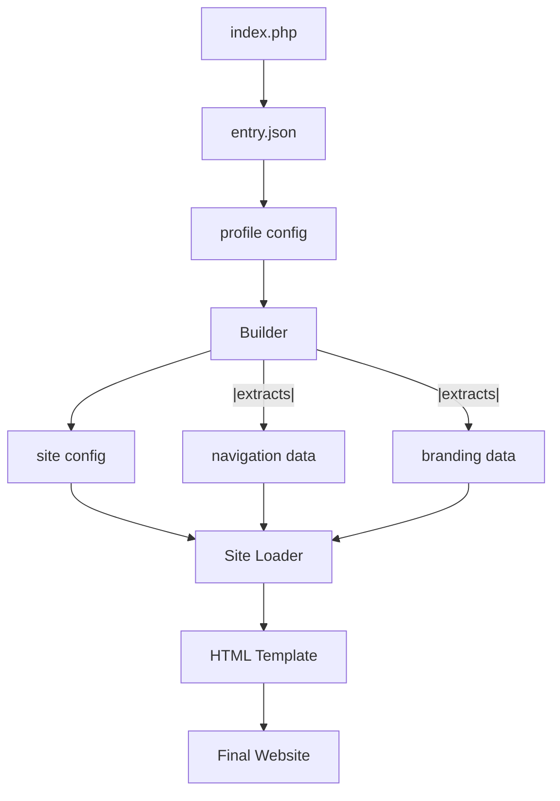

# Portfolio Website Scaffolding System - Architecture Documentation

## **Overview**

This is a **sophisticated, component-based portfolio website scaffolding system** designed to be data-driven, highly modular, and configuration-based. The system allows for creating multiple portfolio variations through simple JSON configuration changes while maintaining clean separation of concerns.

---

## **Design Philosophy**

### **Core Principles**

1. **Configuration Over Code**
   - Content and structure changes through JSON files
   - No need to modify code for different portfolio types
   - Easy content management and updates

2. **Component-Based Architecture**
   - Self-contained blocks with their own templates, styles, and behaviors
   - Reusable components across different profiles
   - Versioned components (using `_t1` suffix) for evolution

3. **Separation of Concerns**
   - **Data** (JSON) ↔ **Structure** (HTML) ↔ **Style** (CSS) ↔ **Behavior** (JS)
   - **Configuration** ↔ **Presentation** ↔ **Logic**
   - Clear boundaries between each layer

4. **Data-Driven Architecture**
   - Builder orchestrates data flow from JSON to HTML
   - Loaders receive specific data as parameters
   - No file reading within loaders - only data processing

---

## **System Architecture**

### **Directory Structure**
```
portfolio-website/
├── index.php                 # Main entry point
├── api.php                   # API entry point
├── README.md                 # Project overview
├── docs/                     # Documentation
│   └── system-architecture.md # This file
├── definitions/             # Configuration files
│   ├── entry.json          # Entry point configuration
│   ├── profiles/           # Profile configurations
│   ├── pages/             # Page definitions
│   └── sites/             # Site layout configurations
├── builders/               # Build system
├── blocks/                 # Component blocks
│   ├── components/         # UI components
│   ├── containers/         # Layout containers
│   └── sites/             # Site-level blocks
├── assets/                 # Static resources
│   ├── files/             # File assets
│   └── media/             # Media assets
└── endpoints/             # API endpoints
```

### **Block Structure Pattern**
Each block follows a consistent pattern:
```
blocks/[type]/[component]/type_1/
├── [component]_structure_t1.html      # HTML template
├── [component]_loader_t1.php          # Dynamic content loader
├── [component]_style_main_t1.css      # Main CSS file
├── [component]_behavior_main_t1.js    # Main JS file
├── styles/                            # CSS modules
└── behaviors/                         # JS modules
```

---

## **Data Flow Architecture**

### **Request Flow**
```
User Request → index.php → entry.json → profile.json → site.json → builder → loader → HTML
```

### **Detailed Flow**
1. **`index.php`** reads `definitions/entry.json`
2. **Entry config** specifies which profile to load (`ml_mlops_t1.json`)
3. **Profile config** specifies site type and pages
4. **Builder** loads site configuration and extracts relevant data
5. **Site loader** receives data and fills HTML template placeholders
6. **Final HTML** returned to browser with all assets properly linked

### **Component Interaction**


---

## **Configuration System**

### **Entry Configuration** (`definitions/entry.json`)
```json
{
    "profile": "ml_mlops_t1.json"
}
```
- Defines which profile to load
- Single source of truth for current active profile

### **Profile Configuration** (`definitions/profiles/[profile].json`)
```json
{
    "site": "top_bar_site_t1.json",
    "pages": [
        "summary_page_t1.json",
        "education_page_t1.json",
        "experience_page_t1.json",
        "skills_page_t1.json",
        "projects_page_t1.json",
        "control_page_t1.json"
    ]
}
```
- Specifies site layout type
- Lists all pages for the profile
- Acts as the main configuration orchestrator

### **Site Configuration** (`definitions/sites/[site].json`)
```json
{
    "type": "top_bar",
    "navigation": {
        "tabs": [
            {
                "id": "summary",
                "label": "About",
                "page": "summary_page_t1.json",
                "active": true
            }
            // ... more tabs
        ]
    },
    "branding": {
        "title": "Portfolio"
    }
}
```
- Defines navigation structure
- Specifies branding elements
- Contains only data, no styling information

---

## **Component System**

### **Site Blocks**
Located in `blocks/sites/[type]/type_1/`
- **Purpose**: Define overall site layout and navigation
- **Example**: `top_bar` site type with horizontal navigation
- **Components**: Structure, Loader, Styles, Behaviors

### **Component Blocks**
Located in `blocks/components/[type]/type_1/`
- **Purpose**: Reusable UI components for content sections
- **Examples**: `hero`, `skills`, `projects`, `experience`
- **Modular**: Each has its own loader and styling

### **Container Blocks**
Located in `blocks/containers/[type]/type_1/`
- **Purpose**: Layout wrappers and structural elements
- **Examples**: `horizontal`, `vertical`, `slider`, `collapsing`
- **Flexible**: Support various content arrangements

---

## **Loader System**

### **Loader Responsibilities**
- **Receive**: Specific data from builder (not read files)
- **Process**: Fill HTML template placeholders with dynamic content
- **Return**: Complete HTML ready for browser

### **Loader Pattern**
```php
class [Component]Loader {
    public function load($specificData, $optionalParams) {
        // Load HTML template
        $template = file_get_contents(__DIR__ . '/template.html');
        
        // Process data and fill placeholders
        $html = str_replace('<!-- placeholder -->', $content, $template);
        
        // Return processed HTML
        return $html;
    }
}
```

### **Key Principles**
- Loaders are **data processors**, not file readers
- Builder extracts and passes only relevant data
- Templates contain static paths and structure
- Dynamic content through placeholder replacement

---

## **Build System**

### **Builder Responsibilities**
1. **Configuration Management**: Load and parse JSON configs
2. **Data Extraction**: Pull relevant data for each component
3. **Component Orchestration**: Instantiate and call appropriate loaders
4. **HTML Assembly**: Combine processed components into final output

### **Builder Flow**
```php
public function build($profileName) {
    // Load configurations
    $profile = $this->loadJson($profileName);
    $site = $this->loadJson($profile['site']);
    
    // Extract data for loaders
    $navigationData = $site['navigation']['tabs'];
    $brandingData = $site['branding']['title'];
    
    // Load site block
    $loader = new SiteLoader();
    return $loader->load($navigationData, $brandingData);
}
```

---

## **Asset Management**

### **CSS Architecture**
- **Main CSS**: Imports modular stylesheets
- **Modular Files**: Separate concerns (resets, variables, layout, navigation)
- **Path Strategy**: Relative to component, resolved at build time

### **JavaScript Architecture**  
- **Main JS**: Imports behavioral modules
- **Module System**: ES6 imports for clean separation
- **Event Handling**: Component-specific behavior encapsulation

### **Static Assets**
- **Profile-Specific**: Assets organized by profile (`ml_mlops_profile/`)
- **Shared Resources**: Common fonts, icons, external CDNs
- **Path Resolution**: Proper relative paths from root

---

## **Extension Points**

### **Adding New Site Types**
1. Create new site block in `blocks/sites/[new_type]/type_1/`
2. Implement loader following the established pattern
3. Add site configuration in `definitions/sites/`
4. Update profile to reference new site type

### **Adding New Components**
1. Create component block in `blocks/components/[component]/type_1/`
2. Implement component loader
3. Define component configuration structure
4. Integrate with page definitions

### **Adding New Profiles**
1. Create profile configuration in `definitions/profiles/`
2. Set up profile-specific assets
3. Configure page definitions
4. Update entry.json to reference new profile

---

## **Current Implementation Status**

### **✅ Completed Features**
- Complete site scaffolding architecture
- Top bar site block with navigation
- Configuration-driven content loading
- Modular CSS and JavaScript system
- Proper asset path resolution
- Clean separation of concerns

### **🚧 Ready for Implementation**
- Individual page loaders
- Component blocks (skills, projects, experience, etc.)
- API endpoints for dynamic content management
- Additional site layout types

### **🎯 Architecture Benefits**
- **Scalable**: Easy to add new components and site types
- **Maintainable**: Clear separation of concerns and modular design
- **Flexible**: Multiple portfolio variations from single codebase
- **Configurable**: Content updates through JSON without code changes

---

## **Technical Specifications**

### **Requirements**
- PHP 7.4+ for backend processing
- Modern browser with ES6 module support
- Web server with PHP support (Apache, Nginx, or PHP dev server)

### **File Naming Convention**
- Configuration files: `[name]_t1.json`
- HTML templates: `[component]_structure_t1.html`
- PHP loaders: `[component]_loader_t1.php`
- CSS files: `[component]_style_[purpose]_t1.css`
- JS files: `[component]_behavior_[purpose]_t1.js`

### **Performance Considerations**
- Minimal file I/O through efficient caching strategy
- Modular CSS/JS loading for optimal resource management
- Configuration parsing optimization for production use

---

This architecture provides a solid foundation for building sophisticated, maintainable, and scalable portfolio websites that can be easily customized and extended without touching the core codebase. 